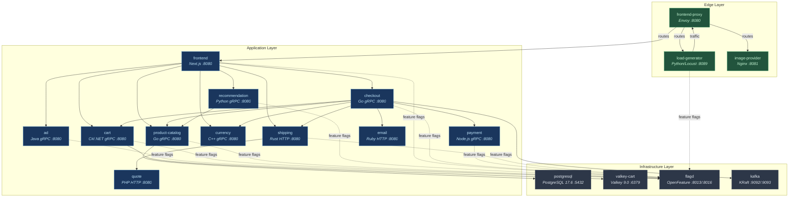
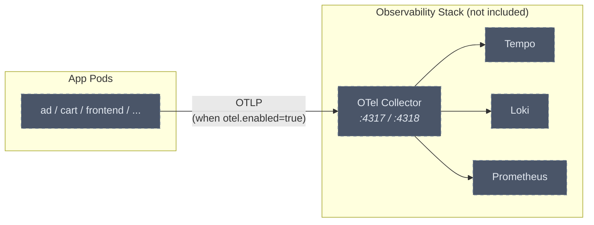

# OTEL-APP

> Microservice Helm charts for the [OpenTelemetry Demo](https://github.com/open-telemetry/opentelemetry-demo) application — decomposed for independent, agent-driven deployments via [TalkOps](https://github.com/talkops-ai).

---

## Overview

This repository contains **18 independent Helm charts** under `charts/` — 4 infrastructure services and 14 application microservices. Each chart is self-contained and can be installed, upgraded, or rolled back individually — making it the ideal playground for TalkOps agents to manage individual microservices.

**Infrastructure charts** (included): `postgresql`, `valkey-cart`, `flagd`, `kafka`
**App charts** (included): `ad`, `cart`, `checkout`, `currency`, `email`, `frontend`, `frontend-proxy`, `image-provider`, `load-generator`, `payment`, `product-catalog`, `quote`, `recommendation`, `shipping`

**Not included** (install via their official charts): OTel Collector, Prometheus, Grafana, Jaeger — these are observability/supporting services and are not required for the app to function.

---

## Architecture

### Service Map



### Service Details

| Chart | Language / Runtime | Protocol | Port(s) | Dependencies | Description |
|---|---|---|---|---|---|
| **Infrastructure** | | | | | |
| `postgresql` | PostgreSQL 17.6 | TCP | 5432 | — | Relational database for product catalog data |
| `valkey-cart` | Valkey 9.0 (Alpine) | TCP | 6379 | — | In-memory key-value store for shopping cart |
| `flagd` | Go (flagd v0.12.9) | gRPC | 8013, 8016 | — | Feature flag evaluation engine (gRPC + OFREP) |
| `kafka` | Java (KRaft) | TCP | 9092, 9093 | — | Message broker, no ZooKeeper dependency |
| **App Services** | | | | | |
| `ad` | Java | gRPC | 8080 | flagd | Returns ads based on context keywords |
| `cart` | C# / .NET | gRPC | 8080 | valkey-cart, flagd | Shopping cart CRUD backed by Valkey |
| `checkout` | Go | gRPC | 8080 | cart, currency, email, payment, product-catalog, shipping, flagd, kafka | Order processing and orchestration |
| `currency` | C++ | gRPC | 8080 | — | Currency conversion service |
| `email` | Ruby | HTTP | 8080 | flagd | Order confirmation email sender |
| `image-provider` | Nginx | HTTP | 8081 | — | Serves product images |
| `payment` | Node.js | gRPC | 8080 | flagd | Payment processing |
| `product-catalog` | Go | gRPC | 8080 | postgresql, flagd | Product listing and details from PostgreSQL |
| `quote` | PHP | HTTP | 8080 | — | Shipping cost quotes |
| `recommendation` | Python | gRPC | 8080 | product-catalog, flagd | Suggests products based on catalog data |
| `shipping` | Rust | HTTP | 8080 | quote, flagd | Shipping calculation, delegates quotes |
| `frontend` | TypeScript / Next.js | HTTP | 8080 | ad, cart, checkout, currency, product-catalog, recommendation, shipping, flagd | Web shop UI, aggregates all backend services |
| `frontend-proxy` | Envoy | HTTP | 8080 | frontend, load-generator, image-provider | Reverse proxy, single entry point for the mesh |
| `load-generator` | Python / Locust | HTTP | 8089 | frontend-proxy, flagd | Synthetic traffic generator for the shop |

### Telemetry Path (opt-in)



> OTel instrumentation is **disabled by default** (`otel.enabled: false`). Enable per-service with `--set otel.enabled=true` when a collector is deployed. See [Enabling OpenTelemetry](#enabling-opentelemetry).

---

## Dependency Graph & Deployment Order

Services must be deployed **bottom-up** — infrastructure first, then services that depend on them. The table below shows the dependency chain and the recommended provisioning order.

### Phase 0 — Infrastructure (Included in This Repo)

These are the foundational services that app microservices depend on. **Deploy these first.**

| Order | Chart | Image | Purpose | Install Command |
|---|---|---|---|---|
| 1 | `postgresql` | `postgres:17.6` | Database for product-catalog | `helm install postgresql charts/postgresql/ -n otel-demo` |
| 2 | `valkey-cart` | `valkey/valkey:9.0.1-alpine3.23` | In-memory store for cart | `helm install valkey-cart charts/valkey-cart/ -n otel-demo` |
| 3 | `flagd` | `ghcr.io/open-feature/flagd:v0.12.9` | Feature flag evaluation | `helm install flagd charts/flagd/ -n otel-demo` |
| 4 | `kafka` | `ghcr.io/open-telemetry/demo:2.2.0-kafka` | Message broker (KRaft, no ZooKeeper) | `helm install kafka charts/kafka/ -n otel-demo` |

> **Note**: Kafka runs in **KRaft mode** — it has zero external dependencies (no ZooKeeper). It is used by the `checkout` service for order event publishing.

### Observability Services (NOT Included — Install Separately)

These are optional supporting services. The app works without them, but telemetry won't be collected/visualized.

| Service | Chart Source | Purpose |
|---|---|---|
| `otel-collector` | [open-telemetry/opentelemetry-collector](https://github.com/open-telemetry/opentelemetry-helm-charts) | Receives telemetry from all services |
| `prometheus` | [prometheus-community/prometheus](https://github.com/prometheus-community/helm-charts) | Metrics storage |
| `grafana` | [grafana/grafana](https://github.com/grafana/helm-charts) | Dashboards |
| `jaeger` | [jaegertracing/jaeger](https://github.com/jaegertracing/helm-charts) | Trace visualization |

### Phase 1 — Backend Services (No App Dependencies)

These services only depend on infrastructure (Phase 0), not on other app services.

| Order | Chart | Depends On | Install Command |
|---|---|---|---|
| 5 | `ad` | flagd | `helm install ad charts/ad/ -n otel-demo` |
| 6 | `cart` | valkey-cart, flagd | `helm install cart charts/cart/ -n otel-demo` |
| 7 | `product-catalog` | postgresql, flagd | `helm install product-catalog charts/product-catalog/ -n otel-demo` |
| 8 | `currency` | — | `helm install currency charts/currency/ -n otel-demo` |
| 9 | `quote` | — | `helm install quote charts/quote/ -n otel-demo` |
| 10 | `email` | flagd | `helm install email charts/email/ -n otel-demo` |
| 11 | `payment` | flagd | `helm install payment charts/payment/ -n otel-demo` |
| 12 | `image-provider` | — | `helm install image-provider charts/image-provider/ -n otel-demo` |

### Phase 2 — Mid-tier Services

These depend on Phase 1 services.

| Order | Chart | Depends On | Install Command |
|---|---|---|---|
| 13 | `recommendation` | product-catalog, flagd | `helm install recommendation charts/recommendation/ -n otel-demo` |
| 14 | `shipping` | quote, flagd | `helm install shipping charts/shipping/ -n otel-demo` |

### Phase 3 — Checkout & Frontend

Depends on all backend and mid-tier services.

| Order | Chart | Depends On | Install Command |
|---|---|---|---|
| 15 | `checkout` | cart, currency, email, payment, product-catalog, shipping, flagd, kafka | `helm install checkout charts/checkout/ -n otel-demo` |
| 16 | `frontend` | ad, cart, checkout, currency, product-catalog, recommendation, shipping, flagd | `helm install frontend charts/frontend/ -n otel-demo` |

### Phase 4 — Edge & Traffic

| Order | Chart | Depends On | Install Command |
|---|---|---|---|
| 17 | `frontend-proxy` | frontend, load-generator, image-provider | `helm install frontend-proxy charts/frontend-proxy/ -n otel-demo` |
| 18 | `load-generator` | frontend-proxy, flagd | `helm install load-generator charts/load-generator/ -n otel-demo` |

> **Note**: `frontend-proxy` and `load-generator` have a soft circular dependency (proxy routes to locust UI, locust targets proxy). Both will start regardless — Envoy and Locust handle missing upstreams gracefully. Install `frontend-proxy` first.

---

## Installing from Helm Repository

Instead of cloning the repository locally, you can add the Helm repository and install charts directly. Assuming the charts are published (e.g., via GitHub Pages), you can add the repository like this:

```bash
# Add the TalkOps Helm repository
helm repo add talkops https://talkops-ai.github.io/OTEL-APP
helm repo update

# Example: Install the ad service chart from the repository
helm install ad talkops/ad -n otel-demo --create-namespace
```

> **Note**: To install from the remote repository, simply replace the local path `charts/<service>/` with `talkops/<service>` in the installation commands below.

---

## Quick Start — Full Deployment

```bash
# 1. Infrastructure (Phase 0) — first install creates the namespace
helm install postgresql   charts/postgresql/   -n otel-demo --create-namespace
helm install valkey-cart   charts/valkey-cart/   -n otel-demo
helm install flagd         charts/flagd/         -n otel-demo
helm install kafka         charts/kafka/         -n otel-demo

# 2. Wait for infra to be ready
kubectl wait --for=condition=available deploy/postgresql deploy/valkey-cart deploy/flagd deploy/kafka -n otel-demo --timeout=120s

# 3. Phase 1 — Backend services (no app dependencies)
helm install ad              charts/ad/              -n otel-demo
helm install cart             charts/cart/             -n otel-demo
helm install product-catalog  charts/product-catalog/  -n otel-demo
helm install currency         charts/currency/         -n otel-demo
helm install quote            charts/quote/            -n otel-demo
helm install email            charts/email/            -n otel-demo
helm install payment          charts/payment/          -n otel-demo
helm install image-provider   charts/image-provider/   -n otel-demo

# 4. Phase 2 — Mid-tier services
helm install recommendation   charts/recommendation/   -n otel-demo
helm install shipping         charts/shipping/         -n otel-demo

# 5. Phase 3 — Checkout & Frontend
helm install checkout         charts/checkout/         -n otel-demo
helm install frontend         charts/frontend/         -n otel-demo

# 6. Phase 4 — Edge & Traffic
helm install frontend-proxy   charts/frontend-proxy/   -n otel-demo
helm install load-generator   charts/load-generator/   -n otel-demo

# 7. Verify all 18 pods are 1/1 Running
kubectl get pods -n otel-demo

# 8. Access the shop
kubectl port-forward svc/frontend-proxy 8080:8080 -n otel-demo
```

### Access Endpoints

| Endpoint | URL | Description |
|---|---|---|
| **Web Shop** | `http://localhost:8080` | Main storefront via frontend-proxy (Envoy) |
| **Locust UI** | `http://localhost:8080/loadgen/` | Load generator web interface |

---

## Enabling OpenTelemetry

By default, OTel instrumentation is **disabled** on all charts (`otel.enabled: false`). Services will run without sending any traces, metrics, or logs to a collector.

### Enable OTel per service

```bash
# Enable on a single chart
helm upgrade ad charts/ad/ -n otel-demo --set otel.enabled=true

# Enable on all services at once
for svc in ad cart checkout currency email frontend frontend-proxy image-provider load-generator payment product-catalog quote recommendation shipping; do
  helm upgrade $svc charts/$svc/ -n otel-demo --set otel.enabled=true
done
```

### What changes when enabled

When `otel.enabled=true`, the following env vars are injected into the container:
- `OTEL_SERVICE_NAME` — auto-set from the `app.kubernetes.io/component` label
- `OTEL_COLLECTOR_NAME` — K8s service name of the collector
- `OTEL_EXPORTER_OTLP_ENDPOINT` — gRPC 4317 or HTTP 4318 endpoint
- `OTEL_RESOURCE_ATTRIBUTES` — service namespace and metadata
- `OTEL_EXPORTER_OTLP_METRICS_TEMPORALITY_PREFERENCE` — cumulative
- Service-specific: `OTEL_LOGS_EXPORTER`, `OTEL_PYTHON_LOG_CORRELATION`, etc.

> **Tip**: This design lets you test the OTel Operator onboarding flow — deploy services without OTel, then selectively enable it via `helm upgrade --set otel.enabled=true` to simulate real-world progressive instrumentation.

---

## How Dependencies Are Discovered

Services in this chart **do not auto-discover** their dependencies. Each chart uses **explicit, DNS-based** service addressing configured in `values.yaml` under `dependencies:`.

### How it works

```yaml
# Example: cart/values.yaml
dependencies:
  valkeyCart:
    host: valkey-cart    # ← Kubernetes Service DNS name
    port: "6379"
  flagd:
    host: flagd
    port: "8013"
```

These are injected as environment variables in the deployment:
```yaml
- name: VALKEY_ADDR
  value: "valkey-cart:6379"    # ← resolved via K8s DNS in the same namespace
```

### Key points

1. **DNS-based**: Each infra chart creates a `Service` object (e.g., `valkey-cart`, `postgresql`). Kubernetes CoreDNS resolves `<service-name>.<namespace>.svc.cluster.local`.
2. **Not auto-discovered**: If you rename an infra chart's release (e.g., `helm install my-redis charts/valkey-cart/`), you must update the dependent app's `values.yaml`:
   ```bash
   helm upgrade cart charts/cart/ -n otel-demo --set dependencies.valkeyCart.host=my-redis
   ```
3. **Same namespace required**: All charts must be deployed in the same namespace for DNS resolution to work with the default short names.

---

## Chart Configuration Reference

Every chart follows the same structure and shares common configuration patterns.

### Common Values (All Charts)

```yaml
# Replicas and image
replicaCount: 1
image:
  repository: ghcr.io/open-telemetry/demo
  tag: ""            # defaults to <appVersion>-<service-name>
  pullPolicy: IfNotPresent

# Private registry support
imagePullSecrets: []

# Service
service:
  type: ClusterIP
  port: 8080         # varies per chart

# Resources — always define BOTH requests and limits
resources:
  requests:
    cpu: 100m
    memory: 200Mi
  limits:
    cpu: 500m
    memory: 300Mi

# Health checks (service-appropriate probe types)
livenessProbe:
  httpGet:
    path: /
    port: service
  initialDelaySeconds: 15
  periodSeconds: 15
  timeoutSeconds: 5
  failureThreshold: 3

readinessProbe:
  httpGet:
    path: /
    port: service
  initialDelaySeconds: 10
  periodSeconds: 10
  timeoutSeconds: 5
  failureThreshold: 3

startupProbe:
  httpGet:
    path: /
    port: service
  initialDelaySeconds: 5
  periodSeconds: 5
  failureThreshold: 30

# Container security — least privilege
securityContext:
  runAsNonRoot: true
  runAsUser: 1000
  runAsGroup: 1000
  allowPrivilegeEscalation: false
  readOnlyRootFilesystem: true    # false for runtimes needing /tmp
  capabilities:
    drop:
      - ALL

# Pod security
podSecurityContext:
  fsGroup: 1000

# Graceful shutdown
terminationGracePeriodSeconds: 30  # 60 for stateful services

# OpenTelemetry (DISABLED by default — opt-in)
otel:
  enabled: false               # set to true when collector is deployed
  collectorName: otel-collector
  exporterEndpoint: ""
  resourceAttributes: "service.namespace=otel-demo"

# ServiceAccount
serviceAccount:
  create: true
  annotations: {}
  name: ""

# Scheduling
nodeSelector: {}
tolerations: []
affinity: {}
topologySpreadConstraints: []
```

### Infrastructure Charts

#### `postgresql` — PostgreSQL Database

| Value | Default | Description |
|---|---|---|
| `image.repository` | `postgres` | PostgreSQL image |
| `image.tag` | `17.6` | PostgreSQL version |
| `service.port` | `5432` | PostgreSQL port |
| `resources.limits.memory` | `100Mi` | Memory limit |
| `postgres.user` | `root` | Superuser name |
| `postgres.password` | `otel` | Superuser password |
| `postgres.database` | `otel` | Default database |
| `initdb.enabled` | `true` | Mount `files/init.sql` for schema initialization |

The `files/init.sql` creates the OTel demo product schema and seed data. Edit it to customize the initial database state.

---

#### `valkey-cart` — Valkey (Redis-compatible) Store

| Value | Default | Description |
|---|---|---|
| `image.repository` | `valkey/valkey` | Valkey image |
| `image.tag` | `9.0.1-alpine3.23` | Valkey version |
| `service.port` | `6379` | Valkey port |
| `resources.limits.memory` | `20Mi` | Memory limit |
| `securityContext.runAsUser` | `999` | Valkey user |

---

#### `flagd` — Feature Flag Service

| Value | Default | Description |
|---|---|---|
| `image.tag` | `v0.12.9` | Flagd version |
| `service.rpcPort` | `8013` | gRPC flag evaluation port |
| `service.ofrepPort` | `8016` | OFREP API port |
| `resources.limits.memory` | `75Mi` | Memory limit |
| `goMemLimit` | `"60MiB"` | Go runtime GOMEMLIMIT |
| `flagdUI.enabled` | `true` | Enable flagd-ui sidecar for live flag editing |
| `flagdUI.port` | `4000` | Flagd UI web port |
| `flagdUI.resources.limits.memory` | `250Mi` | Flagd UI memory limit |
| `otel.collectorName` | `otel-collector` | Collector for flagd's own metrics |

Feature flag definitions live in `files/demo.flagd.json`. Edit this file to add/modify feature flags. The ConfigMap is auto-generated from it.

---

#### `kafka` — Kafka Message Broker (KRaft)

| Value | Default | Description |
|---|---|---|
| `image.repository` | `ghcr.io/open-telemetry/demo` | OTel demo kafka image |
| `image.tag` | `""` | Defaults to `<appVersion>-kafka` |
| `service.plaintextPort` | `9092` | Kafka plaintext listener port |
| `service.controllerPort` | `9093` | KRaft controller port |
| `resources.limits.memory` | `700Mi` | Memory limit (JVM heap) |
| `kafka.heapOpts` | `"-Xmx400M -Xms400M"` | JVM heap settings |
| `securityContext.runAsUser` | `1000` | Appuser |

Runs in **KRaft mode** — no ZooKeeper dependency. Advertised listeners and controller quorum voters are auto-configured from the Helm release name.

---

### App Charts

#### `ad` — Ad Service

| Value | Default | Description |
|---|---|---|
| `service.port` | `8080` | HTTP port |
| `resources.limits.memory` | `300Mi` | Memory limit |
| `dependencies.flagd.host` | `flagd` | Flagd service hostname |
| `dependencies.flagd.port` | `"8013"` | Flagd gRPC port |

The ad service uses **HTTP (port 4318)** for OTLP export (Java SDK default).

---

#### `cart` — Cart Service

| Value | Default | Description |
|---|---|---|
| `service.port` | `8080` | HTTP port |
| `resources.limits.memory` | `160Mi` | Memory limit |
| `dependencies.valkeyCart.host` | `valkey-cart` | Valkey hostname |
| `dependencies.valkeyCart.port` | `"6379"` | Valkey port |
| `dependencies.flagd.host` | `flagd` | Flagd hostname |
| `initContainers.waitForValkey` | `true` | Enable init container that waits for Valkey |

The cart service uses **gRPC (port 4317)** for OTLP export (.NET SDK).

**Example — Custom Valkey address:**
```bash
helm install cart charts/cart/ -n otel-demo \
  --set dependencies.valkeyCart.host=my-redis \
  --set dependencies.valkeyCart.port=6380
```

---

#### `product-catalog` — Product Catalog Service

| Value | Default | Description |
|---|---|---|
| `service.port` | `8080` | HTTP port |
| `resources.limits.memory` | `200Mi` | Memory limit |
| `goMemLimit` | `"160MiB"` | Go runtime GOMEMLIMIT |
| `dependencies.postgresql.host` | `postgresql` | PostgreSQL hostname |
| `dependencies.postgresql.port` | `"5432"` | PostgreSQL port |
| `dependencies.postgresql.user` | `root` | DB username |
| `dependencies.postgresql.password` | `otel` | DB password |
| `dependencies.postgresql.database` | `otel` | DB name |
| `dependencies.postgresql.sslMode` | `disable` | SSL mode |

The connection string is auto-built: `postgres://<user>:<password>@<host>/<database>?sslmode=<sslMode>`

**Example — External PostgreSQL:**
```bash
helm install product-catalog charts/product-catalog/ -n otel-demo \
  --set dependencies.postgresql.host=my-pg.rds.amazonaws.com \
  --set dependencies.postgresql.password=secret123
```

---

#### `recommendation` — Recommendation Service

| Value | Default | Description |
|---|---|---|
| `service.port` | `8080` | HTTP port |
| `resources.limits.memory` | `500Mi` | High to support `recommendationCache` feature flag |
| `dependencies.productCatalog.host` | `product-catalog` | Product Catalog hostname |
| `dependencies.productCatalog.port` | `"8080"` | Product Catalog port |
| `dependencies.flagd.host` | `flagd` | Flagd hostname |

---

#### `frontend` — Frontend Service

| Value | Default | Description |
|---|---|---|
| `service.port` | `8080` | HTTP port |
| `resources.limits.memory` | `250Mi` | Memory limit |
| `securityContext.runAsUser` | `1001` | Next.js user |
| `otel.publicOtlpTracesEndpoint` | `http://localhost:8080/otlp-http/v1/traces` | Browser-side trace endpoint |
| `dependencies.ad.host` | `ad` | Ad service hostname |
| `dependencies.cart.host` | `cart` | Cart service hostname |
| `dependencies.productCatalog.host` | `product-catalog` | Product Catalog hostname |
| `dependencies.recommendation.host` | `recommendation` | Recommendation hostname |
| `dependencies.checkout.host` | `checkout` | Checkout hostname |
| `dependencies.currency.host` | `currency` | Currency hostname |
| `dependencies.shipping.host` | `shipping` | Shipping hostname |
| `dependencies.productReviews.host` | `product-reviews` | Product reviews hostname (optional) |

---

#### `frontend-proxy` — Frontend Proxy (Envoy)

| Value | Default | Description |
|---|---|---|
| `service.port` | `8080` | Envoy listener port |
| `resources.limits.memory` | `65Mi` | Memory limit |
| `securityContext.runAsUser` | `101` | Envoy user |
| `envoy.adminPort` | `10000` | Envoy admin interface port |
| `dependencies.frontend.host` | `frontend` | Frontend hostname |
| `dependencies.grafana.host` | `grafana` | Grafana hostname |
| `dependencies.loadGenerator.host` | `load-generator` | Locust UI hostname |
| `dependencies.jaeger.host` | `jaeger` | Jaeger UI hostname |

---

#### `load-generator` — Load Generator (Locust)

| Value | Default | Description |
|---|---|---|
| `service.port` | `8089` | Locust web UI port |
| `resources.limits.memory` | `1500Mi` | High for browser traffic simulation |
| `locust.users` | `"10"` | Number of simulated users |
| `locust.spawnRate` | `"1"` | User spawn rate per second |
| `locust.headless` | `"false"` | Run without web UI |
| `locust.autostart` | `"true"` | Auto-start load generation |
| `locust.browserTrafficEnabled` | `"true"` | Enable browser traffic simulation |
| `dependencies.frontendProxy.host` | `frontend-proxy` | Target host for load |
| `dependencies.frontendProxy.port` | `"8080"` | Target port |

**Example — Increase load:**
```bash
helm upgrade load-generator charts/load-generator/ -n otel-demo \
  --set locust.users=50 \
  --set locust.spawnRate=5
```

---

## Operational Commands

### Upgrade a single service
```bash
helm upgrade ad charts/ad/ -n otel-demo --set image.tag=2.3.0-ad
```

### Rollback
```bash
helm rollback ad 1 -n otel-demo
```

### Uninstall a single service
```bash
helm uninstall ad -n otel-demo
```

### Uninstall everything
```bash
# App services (reverse order)
for svc in load-generator frontend-proxy frontend checkout recommendation shipping payment email quote currency image-provider product-catalog cart ad; do
  helm uninstall $svc -n otel-demo 2>/dev/null
done

# Infrastructure (after apps are gone)
for svc in kafka flagd valkey-cart postgresql; do
  helm uninstall $svc -n otel-demo 2>/dev/null
done
```

### Dry-run / Diff before install
```bash
helm install --dry-run --debug ad charts/ad/ -n otel-demo
helm template ad charts/ad/ -n otel-demo
```

---

## Repository Structure

```
OTEL-APP/
├── charts/
│   │
│   │── ── Infrastructure ──────────────────────────────
│   ├── postgresql/              # PostgreSQL 17.6
│   ├── valkey-cart/             # Valkey 9.0.1 (Alpine)
│   ├── flagd/                   # Flagd v0.12.9 + Flagd UI sidecar
│   ├── kafka/                   # Kafka KRaft (no ZooKeeper)
│   │
│   │── ── App Services ────────────────────────────────
│   ├── ad/                      # Ad Service (Java, gRPC)
│   ├── cart/                    # Cart Service (C# / .NET, gRPC)
│   ├── checkout/                # Checkout Service (Go, gRPC)
│   ├── currency/                # Currency Service (C++, gRPC)
│   ├── email/                   # Email Service (Ruby, HTTP)
│   ├── image-provider/          # Image Provider (Nginx, HTTP)
│   ├── payment/                 # Payment Service (Node.js, gRPC)
│   ├── product-catalog/         # Product Catalog (Go, gRPC)
│   ├── quote/                   # Quote Service (PHP, HTTP)
│   ├── recommendation/          # Recommendation (Python, gRPC)
│   ├── shipping/                # Shipping Service (Rust, HTTP)
│   ├── frontend/                # Frontend (TypeScript / Next.js)
│   ├── frontend-proxy/          # Frontend Proxy (Envoy)
│   └── load-generator/          # Load Generator (Python / Locust)
│       │
│       │── ── Chart internals (same for all charts) ───
│       ├── Chart.yaml           # Chart metadata + appVersion
│       ├── values.yaml          # All configurable values
│       ├── files/               # Static config files (if any)
│       └── templates/
│           ├── _helpers.tpl     # Template helpers (labels, names)
│           ├── deployment.yaml  # Pod spec w/ probes, security, resources
│           ├── service.yaml     # ClusterIP service
│           ├── serviceaccount.yaml
│           └── NOTES.txt        # Post-install verification commands
│
├── reference/
│   ├── opentelemetry-helm-charts/  # Upstream monolithic chart (reference)
│   └── compose.yaml                # Docker Compose reference
├── scripts/
└── README.md
```

---

## Adding More Services

All 18 core OTel Demo services are included. To add additional custom services:

1. Copy any existing chart as a template: `cp -r charts/ad charts/<new-service>`
2. Update `Chart.yaml` with the service name and description
3. Update `values.yaml` with the correct port, image tag suffix, resource limits, and dependencies
4. Update `templates/_helpers.tpl` — rename all template definitions
5. Update `templates/deployment.yaml` — adjust env vars per the service's requirements
6. Choose the correct health probe type:
   - **gRPC services**: Use `grpc: port: 8080` probes
   - **HTTP services**: Use `httpGet` or `tcpSocket` probes
7. Validate: `helm lint charts/<new-service>/`

---

## License

See [LICENSE](./LICENSE).
